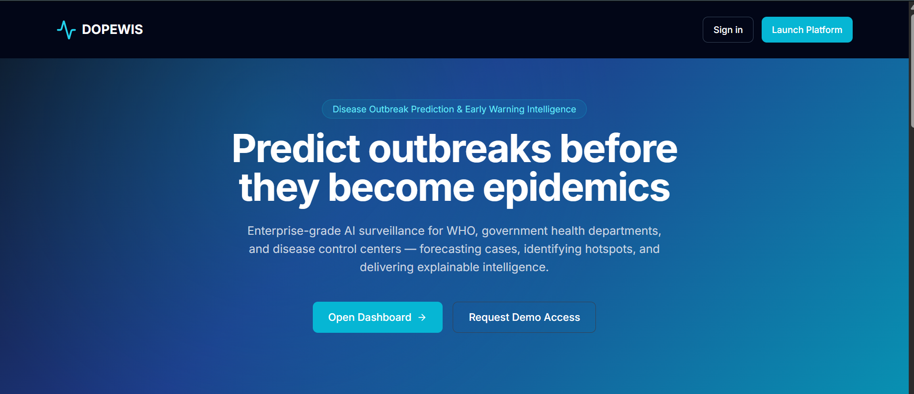
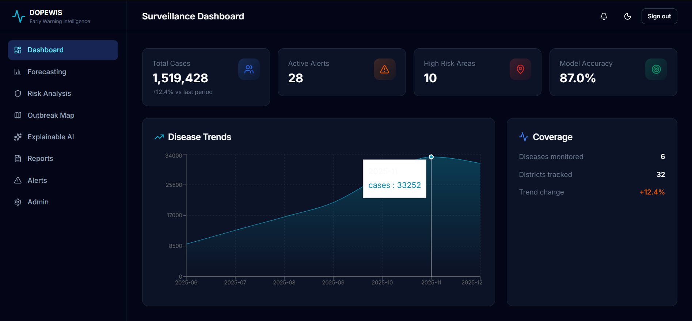
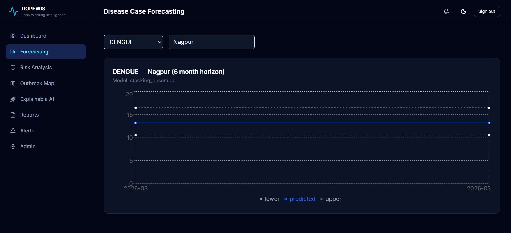
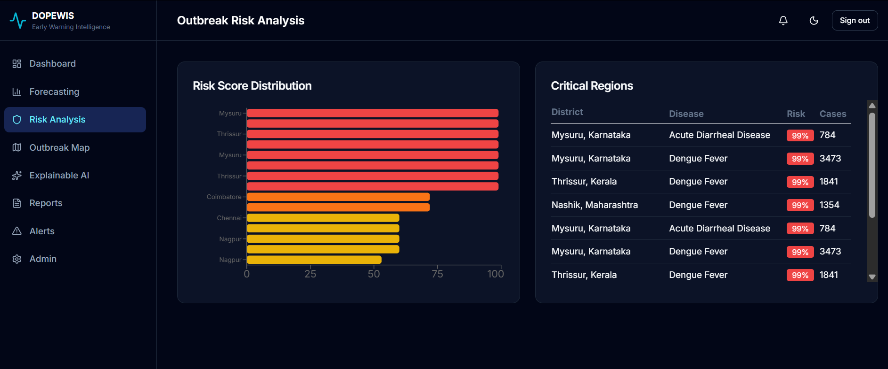
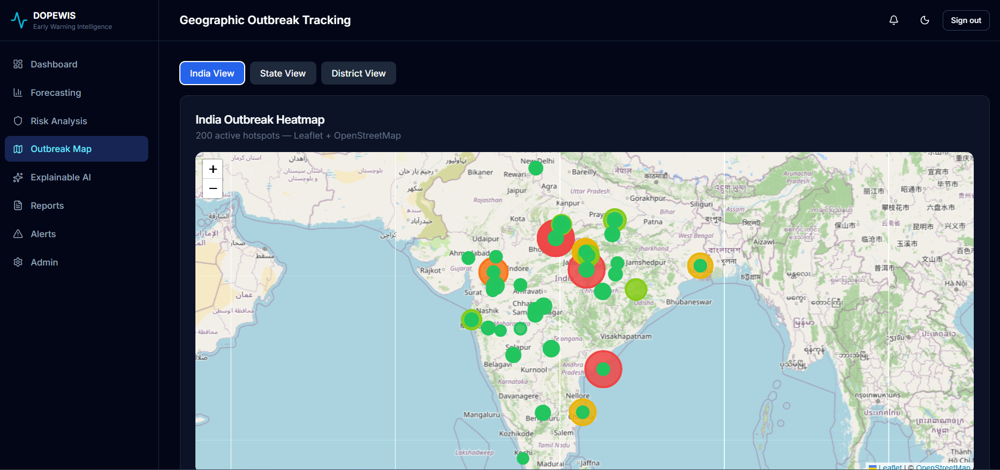
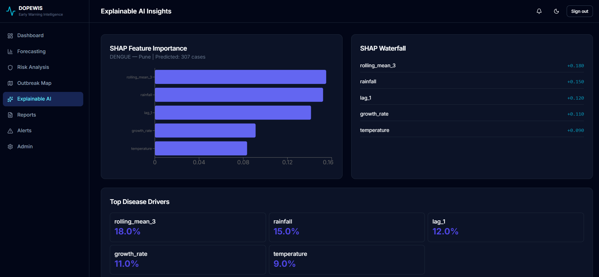
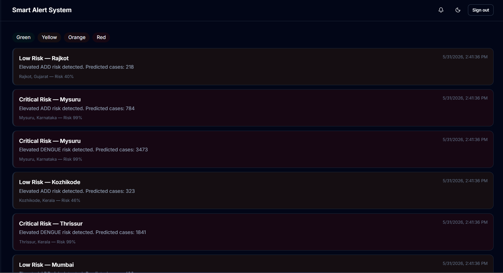
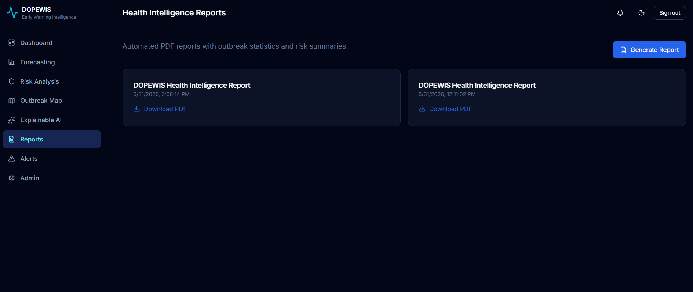
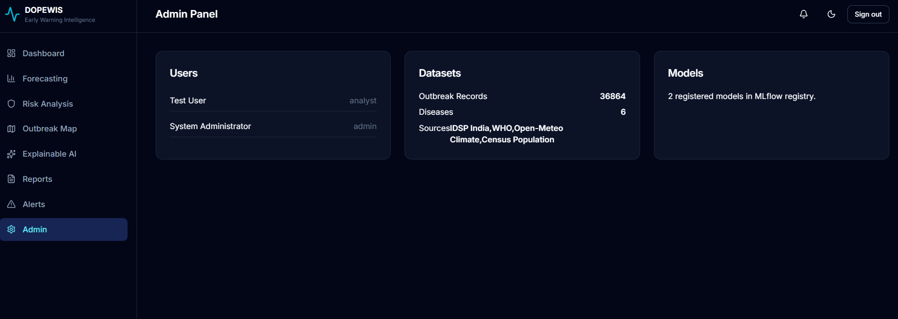

# DOPEWIS

## Disease Outbreak Prediction & Early Warning Intelligence System

**An enterprise-grade AI-powered disease surveillance platform** for outbreak prediction, early warning generation, case forecasting, high-risk area identification, and explainable public health intelligence.

Inspired by real-world disease surveillance systems used by **WHO**, **IDSP**, **public health agencies**, and **epidemiological monitoring organizations.**


---

## Table of Contents

1. [Overview](#overview)
2. [Key Features](#key-features)
3. [Real-World Questions Answered](#real-world-questions-answered)
4. [Architecture](#architecture)
5. [Technology Stack](#technology-stack)
6. [Project Structure](#project-structure)
7. [Prerequisites](#prerequisites)
8. [Installation & Setup](#installation--setup)
9. [Running the Application](#running-the-application)
10. [Default Credentials](#default-credentials)
11. [Application Pages](#application-pages)
12. [Screenshots](#screenshots)
13. [REST API Reference](#rest-api-reference)
14. [Database Schema](#database-schema)
15. [Machine Learning Pipeline](#machine-learning-pipeline)
16. [Feature Engineering](#feature-engineering)
17. [Models & Ensembles](#models--ensembles)
18. [Data Sources](#data-sources)
19. [Authentication & Security](#authentication--security)
20. [Smart Alert System](#smart-alert-system)
21. [MLOps & Model Registry](#mlops--model-registry)
22. [Testing](#testing)
23. [Docker Deployment](#docker-deployment)
24. [Cloud Deployment](#cloud-deployment)
25. [Troubleshooting](#troubleshooting)
26. [Documentation Index](#documentation-index)
27. [Academic Use & License](#academic-use--license)

---

## Overview

**DOPEWIS** (Disease Outbreak Prediction & Early Warning Intelligence System) is a full-stack AI platform that combines:

- **Surveillance data** (IDSP-style disease case reports)
- **Climate data** (temperature, rainfall, humidity, air quality, LAI)
- **Geographic data** (state, district, population, coordinates)
- **Advanced ML** (50+ engineered features, ensemble models, leakage control)
- **Modern SaaS dashboard** (Next.js, real-time charts, interactive maps, XAI)

The system predicts which diseases are likely to increase, identifies high-risk districts, forecasts expected case counts, explains prediction drivers, and generates automated health intelligence reports with smart alerts.

---

## Key Features

### Prediction & Forecasting
- Disease case forecasting (1, 3, 6, 12 month horizons)
- Outbreak risk classification (Safe → Critical)
- Hotspot detection and geographic tracking
- Climate-aware disease analysis

### Machine Learning
- 50+ engineered epidemiological, temporal, climate, and geospatial features
- Classical ML: Logistic Regression, Random Forest, Extra Trees, XGBoost, LightGBM, CatBoost
- Time series: Prophet, ARIMA, SARIMA modules
- Deep learning: LSTM, Bi-LSTM, GRU modules
- Ensembles: Voting, Stacking, Blending
- Class imbalance: SMOTE, Borderline SMOTE, ADASYN, `scale_pos_weight`
- Strict data leakage control with TimeSeriesSplit and audit reports

### Explainable AI
- Feature importance rankings
- SHAP-style summary and waterfall visualizations
- Top disease driver identification

### Platform
- JWT authentication with role-based access (Admin, Analyst, Health Officer)
- Smart alert system (Green / Yellow / Orange / Red)
- PDF intelligence report generation
- Interactive India outbreak map (Leaflet)
- Admin panel for users, datasets, and models
- MLflow experiment tracking and model registry
- Rate limiting, input validation, bcrypt password hashing
- Dark / light mode responsive UI

---

## Real-World Questions Answered

| Question | DOPEWIS Module |
|----------|----------------|
| Which disease is likely to increase? | Forecasting + Risk Analysis |
| Which districts are at risk? | Risk Scores + Interactive Map |
| How severe will the outbreak be? | 5-level Risk Classification |
| How many cases are expected? | Case Forecasting with confidence intervals |
| What factors are causing the outbreak? | Explainable AI (XAI) page |
| What preventive actions should be taken? | Smart Alerts + PDF Reports |

---

## Architecture

```
┌─────────────────────────────────────────────────────────────────────┐
│                         CLIENT LAYER                                │
│  Next.js 14 │ React │ TypeScript │ Tailwind │ Recharts │ Leaflet   │
└───────────────────────────────┬─────────────────────────────────────┘
                                │ REST / JWT
┌───────────────────────────────▼─────────────────────────────────────┐
│                         API LAYER (FastAPI)                         │
│  Auth │ Analytics │ Forecasting │ Alerts │ Reports │ XAI │ Admin   │
│  Rate Limiting │ CORS │ Pydantic Validation │ Swagger OpenAPI       │
└───────────────┬─────────────────────────────┬─────────────────────────┘
                │                             │
┌───────────────▼──────────────┐   ┌──────────▼────────────────────────┐
│      DATA LAYER              │   │       ML LAYER                    │
│  PostgreSQL / SQLite         │   │  Feature Engineering (50+ features) │
│  SQLAlchemy ORM              │   │  Training Pipeline                │
│  8 core tables               │   │  Ensemble Models                  │
└──────────────────────────────┘   │  MLflow Registry                  │
                                   │  Leakage Audit                    │
                                   └───────────────────────────────────┘
```

**Data flow:** Surveillance + climate data → feature engineering → ML training → model registry → API predictions → dashboard + alerts + reports.

See [docs/ARCHITECTURE.md](docs/ARCHITECTURE.md) for the full architecture document.

---

## Technology Stack

### Backend
| Component | Technology |
|-----------|------------|
| Framework | FastAPI |
| ORM | SQLAlchemy 2.x (async) |
| Database | PostgreSQL 16 (production) / SQLite (local dev) |
| Auth | JWT (python-jose) + bcrypt |
| Validation | Pydantic v2 |
| Rate limiting | SlowAPI |
| PDF reports | ReportLab |

### Frontend
| Component | Technology |
|-----------|------------|
| Framework | Next.js 14 (App Router) |
| Language | TypeScript |
| Styling | Tailwind CSS |
| Charts | Recharts |
| Maps | Leaflet + React-Leaflet |
| Animation | Framer Motion |
| Theming | next-themes (dark/light) |

### Machine Learning
| Component | Technology |
|-----------|------------|
| Core | scikit-learn, XGBoost, LightGBM, CatBoost |
| Imbalance | imbalanced-learn (SMOTE, ADASYN) |
| Time series | Prophet, statsmodels (ARIMA/SARIMA) |
| Deep learning | TensorFlow / Keras (LSTM, GRU) |
| Explainability | SHAP, feature importance |
| MLOps | MLflow |

### DevOps
| Component | Technology |
|-----------|------------|
| Containers | Docker, Docker Compose |
| CI | GitHub Actions |
| Cloud-ready | AWS, Azure, GCP, Render, Railway |

---

## Project Structure

```
dopewis/
├── backend/                    # FastAPI REST API
│   ├── app/
│   │   ├── api/v1/             # Route handlers (auth, analytics, alerts, etc.)
│   │   ├── core/               # Config, JWT security
│   │   ├── database/           # SQLAlchemy models & session
│   │   ├── repositories/       # Data access layer
│   │   ├── schemas/            # Pydantic request/response models
│   │   ├── services/           # Business logic
│   │   └── main.py             # Application entry point
│   ├── artifacts/              # Trained models, audit reports, PDFs
│   ├── tests/                  # pytest suite
│   ├── requirements.txt        # Full production dependencies
│   └── requirements-local.txt  # Lightweight local dev dependencies
│
├── frontend/                   # Next.js dashboard
│   └── src/
│       ├── app/                # Pages (dashboard, map, XAI, etc.)
│       ├── components/         # UI, layout, charts, map
│       └── lib/                # API client, utilities
│
├── ml/                         # Machine learning pipeline
│   ├── data/ingestion.py       # Data generation & IDSP CSV loader
│   ├── features/engineering.py # 50+ feature engineering
│   ├── evaluation/             # Leakage audit module
│   ├── models/                 # Classical, time-series, DL, ensemble
│   └── training/               # Full & local training pipelines
│
├── scripts/                    # Automation scripts
│   ├── setup.ps1               # One-time Windows setup
│   ├── start-local.bat         # Start backend + frontend
│   ├── stop-local.bat          # Stop servers
│   ├── run-backend.bat         # Backend only
│   ├── run-frontend.bat        # Frontend only
│   ├── seed_database.py        # Seed surveillance data
│   └── register_model.py       # Register model in DB
│
├── docs/                       # Extended documentation
├── docker-compose.yml
├── .env.example
└── README.md
```

See [FOLDER_STRUCTURE.md](FOLDER_STRUCTURE.md) for the complete tree.

---

## Prerequisites

### Option A — Local development (Windows, no Docker)

| Requirement | Version |
|-------------|---------|
| Python | 3.11+ (3.14 supported with `requirements-local.txt`) |
| Node.js | 20+ |
| npm | 9+ |

### Option B — Docker (recommended for production)

| Requirement | Version |
|-------------|---------|
| Docker | 24+ |
| Docker Compose | 2.20+ |

---

## Installation & Setup

### Windows — One-time setup (recommended)

Open PowerShell in the `dopewis` folder:

```powershell
powershell -ExecutionPolicy Bypass -File scripts\setup.ps1
```

This script will:
1. Create Python virtual environment
2. Install all dependencies
3. Train ML models (~1–2 minutes)
4. Seed the database with 18,000+ surveillance records
5. Register the best model in the model registry

### Windows — Manual setup

```powershell
# 1. Backend virtual environment
cd backend
python -m venv venv
.\venv\Scripts\pip install -r requirements-local.txt

# 2. Backend environment
copy .env.example .env

# 3. Train ML models
cd ..
.\backend\venv\Scripts\python.exe -m ml.training.pipeline_local

# 4. Seed database
.\backend\venv\Scripts\python.exe scripts\seed_database.py
.\backend\venv\Scripts\python.exe scripts\register_model.py

# 5. Frontend dependencies
cd frontend
npm install
echo NEXT_PUBLIC_API_URL=http://localhost:8000 > .env.local
```

### Docker setup

```bash
cd dopewis
cp .env.example .env
docker compose up --build
```

| Service | URL |
|---------|-----|
| Frontend | http://localhost:3000 |
| Backend API | http://localhost:8000 |
| Swagger Docs | http://localhost:8000/docs |
| MLflow | http://localhost:5000 |

---

## Running the Application

### Easiest way (Windows)

1. Navigate to `dopewis\scripts\`
2. Double-click **`start-local.bat`**
3. Two CMD windows open (Backend + Frontend) — **keep them open**
4. Open browser → **http://localhost:3000**

To stop: double-click **`stop-local.bat`**

> **Important:** After you see `Application startup complete` (backend) or `Ready` (frontend), the terminal is **not stuck** — the server is running and waiting for browser requests.

### Manual start (two terminals)

**Terminal 1 — Backend:**
```cmd
cd dopewis\backend
set PYTHONPATH=.
venv\Scripts\python.exe -m uvicorn app.main:app --reload --host 127.0.0.1 --port 8000
```

**Terminal 2 — Frontend:**
```cmd
cd dopewis\frontend
npm run dev
```

### Health checks

| URL | Expected response |
|-----|-------------------|
| http://localhost:8000/health | `{"status":"healthy","service":"DOPEWIS"}` |
| http://localhost:3000 | Landing page loads |

See [docs/HOW_TO_RUN.md](docs/HOW_TO_RUN.md) for detailed run instructions and common mistakes.

---

## Default Credentials

| Role | Email | Password |
|------|-------|----------|
| **Admin** | `admin@dopewis.health` | `Admin@12345` |

Additional users can register at `/signup` (default role: Analyst).

### User Roles

| Role | Permissions |
|------|-------------|
| **Admin** | Full access — users, models, datasets, all analytics |
| **Analyst** | Dashboard, forecasting, risk, maps, reports, alerts |
| **Health Officer** | Dashboard, alerts, reports, district-level views |

---

## Application Pages

| Page | Route | Description |
|------|-------|-------------|
| Landing | `/` | Hero, features, architecture, statistics |
| Login | `/login` | JWT authentication |
| Signup | `/signup` | User registration |
| Dashboard | `/dashboard` | KPIs, disease trends, coverage stats |
| Forecasting | `/forecasting` | Case predictions with confidence intervals |
| Risk Analysis | `/risk` | Risk scores, distribution, critical regions |
| Outbreak Map | `/map` | India district hotspot map (Leaflet) |
| Explainable AI | `/explainability` | SHAP summary, waterfall, top drivers |
| Reports | `/reports` | Generate & download PDF intelligence reports |
| Alerts | `/alerts` | Green/Yellow/Orange/Red smart alerts |
| Admin | `/admin` | Users, datasets, model registry |

---

## Screenshots

### Landing Page



*Modern responsive landing page introducing DOPEWIS and its capabilities.*

---

### Dashboard



*Real-time disease surveillance dashboard showing KPIs, trends, and outbreak statistics.*

---

### Disease Forecasting



*AI-powered forecasting with confidence intervals and future outbreak predictions.*

---

### Risk Analysis



*District-level risk scoring and outbreak severity assessment.*

---

### Outbreak Map



*Interactive India map highlighting disease hotspots and high-risk regions.*

---

### Explainable AI (XAI)



*Model interpretation using feature importance and prediction explanations.*

---

### Smart Alerts



*Automated outbreak alerts with Green, Yellow, Orange, and Red risk levels.*

---

### PDF Reports



*Automated intelligence report generation for health officers and analysts.*

---

### Admin Panel



*Administrative interface for users, datasets, and model management.*

---

## REST API Reference

**Base URL:** `http://localhost:8000/api/v1`  
**Interactive docs:** http://localhost:8000/docs  
**ReDoc:** http://localhost:8000/redoc

### Authentication

| Method | Endpoint | Description |
|--------|----------|-------------|
| POST | `/auth/register` | Create new user account |
| POST | `/auth/login` | Login, returns JWT access + refresh tokens |
| GET | `/auth/me` | Get current user profile |
| PATCH | `/auth/profile` | Update profile |
| POST | `/auth/forgot-password` | Request password reset |
| POST | `/auth/change-password` | Change password |

### Analytics

| Method | Endpoint | Description |
|--------|----------|-------------|
| GET | `/analytics/dashboard` | KPI statistics (cases, alerts, accuracy) |
| GET | `/analytics/trends` | Disease trend time series |
| GET | `/analytics/forecast` | Case forecast by disease & district |
| GET | `/analytics/risk` | Risk scores ranked by district |
| GET | `/analytics/map/hotspots` | Geographic hotspot data for map |
| GET | `/analytics/climate-impact` | Climate-disease correlation analysis |
| GET | `/analytics/compare/states` | State-level case comparison |

### Alerts

| Method | Endpoint | Description |
|--------|----------|-------------|
| GET | `/alerts` | List active alerts |
| PATCH | `/alerts/{id}/read` | Mark alert as read |
| POST | `/alerts/test-email` | Send test email alert (Admin) |

### Explainability

| Method | Endpoint | Description |
|--------|----------|-------------|
| GET | `/explainability` | SHAP summary, waterfall, top features |

### Reports

| Method | Endpoint | Description |
|--------|----------|-------------|
| POST | `/reports/generate` | Generate PDF intelligence report |
| GET | `/reports` | List user's reports |
| GET | `/reports/{id}/download` | Download PDF report |

### Admin

| Method | Endpoint | Description |
|--------|----------|-------------|
| GET | `/admin/users` | List all users |
| GET | `/admin/datasets/stats` | Dataset statistics |
| GET | `/admin/models` | Model registry entries |

### Example — Login & fetch dashboard

```bash
# Login
curl -X POST http://localhost:8000/api/v1/auth/login \
  -H "Content-Type: application/json" \
  -d '{"email":"admin@dopewis.health","password":"Admin@12345"}'

# Dashboard (replace TOKEN)
curl http://localhost:8000/api/v1/analytics/dashboard \
  -H "Authorization: Bearer TOKEN"
```

---

## Database Schema

### Tables

| Table | Purpose |
|-------|---------|
| `users` | User accounts, roles, authentication |
| `diseases` | Disease definitions (Dengue, Malaria, Cholera, etc.) |
| `outbreaks` | District-level surveillance case records |
| `climate_data` | Temperature, rainfall, humidity, AQI, LAI |
| `predictions` | ML forecast outputs with risk scores |
| `alerts` | Smart alert notifications |
| `reports` | Generated PDF report metadata |
| `model_registry` | MLflow model versions and metrics |

### Diseases tracked

| Code | Disease | Category |
|------|---------|----------|
| DENGUE | Dengue Fever | Vector-borne |
| MALARIA | Malaria | Vector-borne |
| CHOLERA | Cholera | Waterborne |
| CHIKUNGUNYA | Chikungunya | Vector-borne |
| AES | Acute Encephalitis Syndrome | Neurological |
| ADD | Acute Diarrheal Disease | Waterborne |

See [docs/DATABASE.md](docs/DATABASE.md) for the full ER diagram.

---

## Machine Learning Pipeline

### Training (local — recommended for Windows)

```powershell
cd dopewis
.\backend\venv\Scripts\python.exe -m ml.training.pipeline_local
.\backend\venv\Scripts\python.exe scripts\register_model.py
```

### Training (full — Docker / Linux with all dependencies)

```bash
cd ml
python -m training.pipeline
```

### Pipeline stages

```
1. Data Ingestion     → ml/data/ingestion.py
2. Feature Engineering → ml/features/engineering.py (50+ features)
3. Leakage Audit      → ml/evaluation/leakage_audit.py
4. Model Training     → Classical + Ensemble comparison
5. Model Selection    → Best ROC-AUC model auto-selected
6. Artifact Export    → backend/artifacts/best_model.joblib
7. MLflow Logging     → mlruns/ experiment tracking
8. Registry Update    → scripts/register_model.py
```

### Outputs

| File | Description |
|------|-------------|
| `backend/artifacts/best_model.joblib` | Production-ready best model |
| `backend/artifacts/model_meta.joblib` | Feature columns, importances, metrics |
| `backend/artifacts/leakage_audit.json` | Temporal leakage audit report |
| `backend/artifacts/training_results.json` | All model comparison metrics |
| `mlruns/` | MLflow experiment runs |

### Retraining

```powershell
.\backend\venv\Scripts\python.exe -m ml.training.retrain
```

---

## Feature Engineering

**50+ features** generated with strict chronological ordering to prevent data leakage.

### Temporal Features
`lag_1`, `lag_2`, `lag_3`, `lag_6`, `lag_12`

### Rolling Features
`rolling_mean_3`, `rolling_mean_6`, `rolling_std_3`, `rolling_std_6`

### Epidemic Intelligence Features
`acceleration`, `outbreak_frequency`, `spike_ratio`, `growth_rate`, `moving_growth_rate`, `disease_burden_index`, `outbreak_memory`, `outbreak_streak`, `risk_velocity`

### Climate Features
`temperature`, `rainfall`, `humidity`, `precipitation`, `leaf_area_index`, `temperature_change`, `rainfall_change`, `wind_speed`, `air_quality_index`

### Seasonality Features
`month`, `quarter`, `year`, `season`, `month_sin`, `month_cos`

### Geospatial Features
`district_count`, `concentration_ratio`, `district_expansion`, `geo_spread`, `cluster_density`, `population`, `population_density`, `latitude`, `longitude`

### Trend Features
`yoy_change`, `moving_trend`, `disease_velocity`, `disease_momentum`

---

## Models & Ensembles

### Classical Models
| Model | Library |
|-------|---------|
| Logistic Regression | scikit-learn |
| Random Forest | scikit-learn |
| Extra Trees | scikit-learn |
| XGBoost | xgboost |
| LightGBM | lightgbm |
| CatBoost | catboost |

### Time Series Models
| Model | Library |
|-------|---------|
| Prophet | prophet |
| ARIMA | statsmodels |
| SARIMA | statsmodels |

### Deep Learning Models
| Model | Library |
|-------|---------|
| LSTM | TensorFlow/Keras |
| Bi-LSTM | TensorFlow/Keras |
| GRU | TensorFlow/Keras |

### Ensemble Methods
| Method | Description |
|--------|-------------|
| Voting Ensemble | Soft voting across XGBoost + LightGBM |
| Stacking Ensemble | XGB + LGB + RF → Logistic Regression meta-learner |
| Blending | Weighted average of model probabilities |

### Class Imbalance Handling
- SMOTE
- Borderline SMOTE
- ADASYN
- `scale_pos_weight` (XGBoost)
- Threshold optimization

### Data Leakage Control
- `TimeSeriesSplit` (5 folds)
- Chronological validation (train max date < test min date)
- Fold-based statistics and threshold checks
- Automated leakage audit JSON report

---

## Data Sources

### Currently integrated (synthetic IDSP-calibrated)

The platform ships with **realistic India district-level surveillance data** calibrated to IDSP/WHO seasonality patterns across 8 states, 30+ districts, and 6 diseases (2018–2025).

### Real data integration

Replace synthetic data with official sources:

| Source | Data | Link |
|--------|------|------|
| IDSP India | Weekly disease surveillance | [data.gov.in](https://data.gov.in) |
| WHO | Global Health Observatory | [WHO GHO](https://www.who.int/data/gho) |
| Open-Meteo | Climate (temp, rain, humidity) | [open-meteo.com](https://open-meteo.com) |
| Census | Population by district | [censusindia.gov.in](https://censusindia.gov.in) |

**Steps to use real IDSP CSV:**

1. Download CSV from data.gov.in
2. Place at `ml/data/raw/idsp.csv`
3. Run ingestion:

```python
from pathlib import Path
from ml.data.ingestion import load_idsp_csv, save_processed

df = load_idsp_csv(Path("ml/data/raw/idsp.csv"))
save_processed(df, Path("ml/data/processed/surveillance.parquet"))
```

4. Retrain: `python -m ml.training.pipeline_local`
5. Reseed: `python scripts/seed_database.py`

---

## Authentication & Security

| Feature | Implementation |
|---------|----------------|
| Password hashing | bcrypt |
| Token auth | JWT (access + refresh tokens) |
| Role-based access | Admin, Analyst, Health Officer |
| Rate limiting | SlowAPI (120 req/min default) |
| Input validation | Pydantic v2 schemas |
| CORS | Configurable origin whitelist |
| SQL injection | SQLAlchemy parameterized queries |

### Environment variables (security)

```env
SECRET_KEY=your-long-random-secret-key
ACCESS_TOKEN_EXPIRE_MINUTES=60
REFRESH_TOKEN_EXPIRE_DAYS=7
CORS_ORIGINS=http://localhost:3000
RATE_LIMIT_PER_MINUTE=120
```

---

## Smart Alert System

Alerts are automatically generated based on prediction score, risk score, and forecasted cases.

| Alert Level | Color | Trigger |
|-------------|-------|---------|
| Green | Safe | Risk score < 0.45 |
| Yellow | Low/Medium | Risk score 0.45 – 0.70 |
| Orange | High | Risk score 0.70 – 0.85 |
| Red | Critical | Risk score ≥ 0.85 |

### Risk classification

| Level | Score Range |
|-------|-------------|
| Safe | < 0.30 |
| Low Risk | 0.30 – 0.50 |
| Medium Risk | 0.50 – 0.70 |
| High Risk | 0.70 – 0.85 |
| Critical Risk | ≥ 0.85 |

Email alerts are supported via SMTP configuration in `.env`:

```env
SMTP_HOST=smtp.gmail.com
SMTP_PORT=587
SMTP_USER=your-email@gmail.com
SMTP_PASSWORD=your-app-password
ALERT_FROM_EMAIL=alerts@dopewis.health
```

---

## MLOps & Model Registry

| Feature | Tool |
|---------|------|
| Experiment tracking | MLflow |
| Model versioning | MLflow + `model_registry` DB table |
| Artifact storage | `backend/artifacts/` |
| Retraining pipeline | `ml/training/retrain.py` |
| Leakage audit reports | `backend/artifacts/leakage_audit.json` |

**MLflow UI:** http://localhost:5000 (when running via Docker)

---

## Testing

### Backend tests

```powershell
cd backend
set PYTHONPATH=.
..\backend\venv\Scripts\pytest.exe -v
```

**Test coverage (7 tests):**
- Health endpoint
- User registration and login
- Dashboard authentication guard
- Authenticated dashboard data
- Feature engineering (50+ features)
- No infinite values in features
- Lag feature temporal shifting

### Frontend lint

```powershell
cd frontend
npm run lint
npm run build
```

### CI

GitHub Actions workflow at `.github/workflows/ci.yml` runs backend tests and frontend build on push.

---

## Docker Deployment

```bash
# Start all services
docker compose up --build -d

# View logs
docker compose logs -f backend

# Stop
docker compose down
```

### Services

| Container | Port | Description |
|-----------|------|-------------|
| dopewis-postgres | 5432 | PostgreSQL database |
| dopewis-mlflow | 5000 | MLflow tracking server |
| dopewis-backend | 8000 | FastAPI application |
| dopewis-frontend | 3000 | Next.js dashboard |

---

## Cloud Deployment

See [docs/DEPLOYMENT.md](docs/DEPLOYMENT.md) for detailed guides.

| Platform | Backend | Frontend | Database |
|----------|---------|----------|----------|
| **AWS** | ECS Fargate | Amplify / S3+CloudFront | RDS PostgreSQL |
| **Azure** | App Service | Static Web Apps | Azure Database for PostgreSQL |
| **GCP** | Cloud Run | Cloud Run | Cloud SQL |
| **Render** | Web Service (Docker) | Static Site | Render PostgreSQL |
| **Railway** | `railway up` | Railway | Railway PostgreSQL |

---

## Troubleshooting

### If Terminal looks "stuck" after startup

**This is normal.** After `Application startup complete` or `Ready`, the server is running and waiting for requests. Open http://localhost:3000 in your browser.

### `uvicorn` not recognized

Use the full venv path:
```cmd
venv\Scripts\python.exe -m uvicorn app.main:app --reload
```

### PowerShell blocks `activate.ps1`

Skip activation. Use `venv\Scripts\python.exe` directly instead of activating the venv.

### Port already in use

```cmd
scripts\stop-local.bat
```

Or manually:
```cmd
netstat -ano | findstr :8000
taskkill /F /PID <pid>
```

### Empty dashboard / no data

Run the seed script:
```powershell
.\backend\venv\Scripts\python.exe scripts\seed_database.py
```

### ML model not loaded

Retrain and register:
```powershell
.\backend\venv\Scripts\python.exe -m ml.training.pipeline_local
.\backend\venv\Scripts\python.exe scripts\register_model.py
```

### CORS errors in browser

Add your frontend URL to `CORS_ORIGINS` in `backend/.env`:
```env
CORS_ORIGINS=http://localhost:3000,http://127.0.0.1:3000
```

### Wrong directory errors

| You are in | Run backend from |
|------------|-----------------|
| `dopewis/` | `cd backend` then start |
| `dopewis/backend/` | Already correct — do NOT `cd dopewis` again |

---

## Documentation Index

| Document | Description |
|----------|-------------|
| [README.md](README.md) | This file — complete project guide |
| [docs/HOW_TO_RUN.md](docs/HOW_TO_RUN.md) | Step-by-step run instructions (Windows) |
| [docs/ARCHITECTURE.md](docs/ARCHITECTURE.md) | System architecture diagram |
| [docs/DATABASE.md](docs/DATABASE.md) | ER diagram and schema details |
| [docs/SETUP.md](docs/SETUP.md) | Detailed setup guide |
| [docs/DEPLOYMENT.md](docs/DEPLOYMENT.md) | Cloud deployment guide |
| [docs/PROJECT_REPORT.md](docs/PROJECT_REPORT.md) | B.Tech project report outline |
| [docs/PRESENTATION.md](docs/PRESENTATION.md) | Viva presentation slide content |
| [docs/LOCAL_DEV.md](docs/LOCAL_DEV.md) | Local development notes |
| [FOLDER_STRUCTURE.md](FOLDER_STRUCTURE.md) | Complete folder tree |

---

## Academic Use & License

This project is developed as a **B.Tech AI Internship project** and portfolio showcase for **Regional Epidemiological Surveillance**.

**Intended use:** Academic submission, viva demonstration, GitHub portfolio, public health research prototype.

**Not intended for:** Direct clinical decision-making without validation against official surveillance data and expert review.

---

## Quick Reference Card

```
┌─────────────────────────────────────────────────────┐
│  DOPEWIS Quick Start                                │
├─────────────────────────────────────────────────────┤
│  Setup (once):  scripts\setup.ps1                   │
│  Start:         scripts\start-local.bat             │
│  Stop:          scripts\stop-local.bat              │
│  Frontend:      http://localhost:3000             │
│  API Docs:      http://localhost:8000/docs        │
│  Login:         admin@dopewis.health                │
│  Password:      Admin@12345                         │
└─────────────────────────────────────────────────────┘
```

---

**DOPEWIS** — *Predict outbreaks before they become epidemics.*
