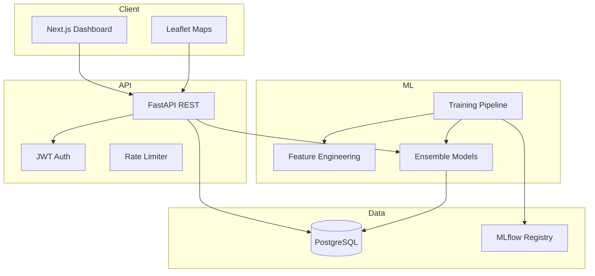

# System Architecture

## Overview

DOPEWIS follows a **three-tier microservice-ready architecture**:



## Component Responsibilities

### Frontend (Next.js 14)

- Server and client components
- Role-aware dashboards
- Recharts visualizations
- Leaflet geographic layers
- Dark/light theming

### Backend (FastAPI)

| Layer | Purpose |
|-------|---------|
| `api/v1` | REST route handlers |
| `services` | Business logic, alerts, reports |
| `repositories` | Data access (via SQLAlchemy) |
| `core` | Configuration, JWT, security |

### ML Pipeline

1. **Ingestion** — Surveillance + climate + geographic data
2. **Feature Engineering** — 50+ chronologically safe features
3. **Leakage Audit** — TimeSeriesSplit validation report
4. **Training** — Classical, deep learning, ensemble comparison
5. **Registry** — MLflow versioning + joblib artifacts

## Security Architecture

- bcrypt password hashing
- JWT access + refresh tokens
- Role-based access control (RBAC)
- SlowAPI rate limiting
- CORS whitelist
- Pydantic input validation

## Alert Flow

```
Prediction Score → Risk Level → Alert Color → Dashboard + Email
```

| Risk Score | Level | Alert |
|------------|-------|-------|
| ≥ 0.85 | Critical | Red |
| ≥ 0.70 | High | Orange |
| ≥ 0.45 | Medium/Low | Yellow |
| < 0.45 | Safe | Green |
