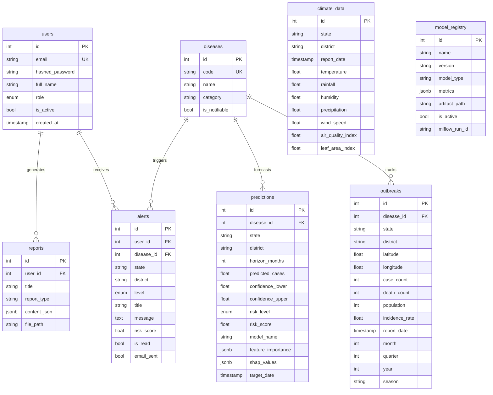

# Database Schema (ER Diagram)

```mermaid
erDiagram
    users ||--o{ alerts : receives
    users ||--o{ reports : generates
    diseases ||--o{ outbreaks : tracks
    diseases ||--o{ predictions : forecasts
    diseases ||--o{ alerts : triggers

    users {
        int id PK
        string email UK
        string hashed_password
        string full_name
        enum role
        bool is_active
        timestamp created_at
    }

    diseases {
        int id PK
        string code UK
        string name
        string category
        bool is_notifiable
    }

    outbreaks {
        int id PK
        int disease_id FK
        string state
        string district
        float latitude
        float longitude
        int case_count
        int death_count
        int population
        float incidence_rate
        timestamp report_date
        int month
        int quarter
        int year
        string season
    }

    climate_data {
        int id PK
        string state
        string district
        timestamp report_date
        float temperature
        float rainfall
        float humidity
        float precipitation
        float wind_speed
        float air_quality_index
        float leaf_area_index
    }

    predictions {
        int id PK
        int disease_id FK
        string state
        string district
        int horizon_months
        float predicted_cases
        float confidence_lower
        float confidence_upper
        enum risk_level
        float risk_score
        string model_name
        jsonb feature_importance
        jsonb shap_values
        timestamp target_date
    }

    alerts {
        int id PK
        int user_id FK
        int disease_id FK
        string state
        string district
        enum level
        string title
        text message
        float risk_score
        bool is_read
        bool email_sent
    }

    reports {
        int id PK
        int user_id FK
        string title
        string report_type
        jsonb content_json
        string file_path
    }

    model_registry {
        int id PK
        string name
        string version
        string model_type
        jsonb metrics
        string artifact_path
        bool is_active
        string mlflow_run_id
    }
```

## Indexes

- `outbreaks(state, district, report_date)`
- `predictions(risk_level, risk_score)`
- `users(email)` unique
- `diseases(code)` unique
